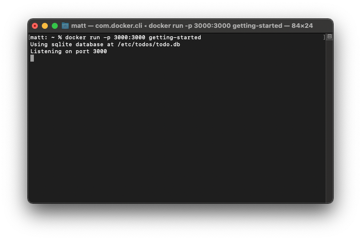

# Docker Demo

## Setup

The setup for this demo is pretty simple. Just download [Docker Desktop](https://www.docker.com/get-started) and download the app.zip file inside this repo. The app.zip file is a Todo-List app we'll be using for the purposes of this demo.

## Instructions

1. Open Docker Desktop

    On the left hand side, you'll notice there's different tabs you can switch between. 
    - The Containers tab will list any container you have installed on your computer and allow you to perform basic operations like starting a container, stopping it, deleting it, etc. 
    
    - The Images tab will list any images you've downloaded. Remember, an image is just a collection of your app, a few config files, and any libraries/packages your app needs (like Python packages, C++ libraries, etc). You can think of an image as like a ZIP file. 
    
    	Images are important because we use them to create containers. For example, if you were creating a Ubuntu container, the Ubuntu Operating System would be the container's image.

</br>

2. Open the app folder

	Extract the app.zip file you downloaded earlier and open it up with your favorite code editor. If you poke around inside the src folder, you'll see the javascript files we'll be using for our Todo-List app. Right now our application is just a bunch of code files, so if we want to deploy our application to a container, we'll need to first create an image. 

	Inside your app folder, open up out the file named Dockerfile. In a moment from now when we go to create our image, this is how we'll let Docker know what we want to include inside our image.

	Inside the Dockerfile there's a bunch of commands. Here's what each of those mean:

	- ```FROM node:12-alpine ```

		To run our JavaScript Todo-List application, we're going to use NodeJS, a popular open source library. This command will tell our container to use NodeJS's image as a base layer for our image. 

		the "node" part is the name of the NodeJS image and the part after the colon, "12-alpine" is the tag. You can think of the tag as the version of the image like Alpha 1.0, Beta 1.2, Latest, etc.

		But where is this node image coming from? 

		Typically when you use containers in production, you'll have a server setup to host all of the images you'll use for your containers kind of like a private GitHub repo. If you don't specify a path to that repository, Docker will automatically assume you want to use theirs called [Docker Hub](https://hub.docker.com/). A lot of major open source software programs like NodeJS, Redis, Ubuntu, Python, etc. host official copies of their software on Docker Hub. Users can also upload their own custom images to Docker Hub and list them either publicly or privately.

		Later, once our image has been built and we use it to create a new container, Docker will check to see if the NodeJS image is installed locally. If it is, great! Docker will use it. But if it's not, Docker will pull it down from Docker Hub.

	- ```RUN apk add --no-cache python2 g++ make```

		This command installs some additional packages our app needs.

	- ```WORKDIR /app```

		Sometimes when we use commands like RUN, CMD, COPY, etc. we need those commands to be executed inside a specific folder. This command set the current working directory to our app's folder.

	- ```COPY . .```

		This command adds all of the files in our current working directory to our image
    
	- ```RUN yarn install --production```

		This command installs the latest NodeJS package dependencies

	- ```CMD ["node", "src/index.js"]```

		This runs our JavaScript app using NodeJS. CMD is always the last line in a Dockerfile because it's responsible for telling Docker what to do once the container starts up

    </br>

3. Build the image

	Open a terminal, cd into the app folder and run

	```docker build -t getting-started .```

	```-t``` Let's us specify the name and tag. In this case our name is going to be "getting-started" and since we didn't specify a tag, Docker will default to "latest"

	```.``` Specifies the path as the current directory. All the files in the current directory are sent to a Docker process and then in our Dockerfile, if it needs to refer to any files, it will refer to the files sent to the Docker process

</br>

4. Run the container

	Now run

	```docker run -d -p 3000:3000 getting-started```

	```-d``` tells docker to run this container in detached mode. If we didn't specify this, Docker would run the container attached to the terminal like this:

	
	
	And we wouldn't be able to run any more commands in that terminal window until we stop the container. 

	By running the container in detached mode we can now run more commands after we start the container like this:

	

	```-p``` specifies the port we want our container to be accessible at. By default, containers are isolated, no one outside or inside the container can communicate with one another. If we want our container to be accessible, we have to open it up for port 3000

	```getting-started``` this is the name of our image
	
	</br>

	Now if you open up your browser and go to ```localhost:3000``` you should see this!

	

	If you open up Docker Desktop, you'll also see the container we just made listed. The name for our container is a little weird, but that's okay. If we don't specify a name when we create our container, Docker will randomly generate one.

	Try stopping and starting the container using Docker Desktop. Refresh the page in between each action and see how it affects the website.


	</br>

	In Docker Desktop, you can see all of your containeres and images easily. You can also see the same thing by using terminal and running

	```docker ps``` this will list any running containers
	```docker ps -a``` this will list all containers, including any stopped

	```docker images``` this will list any images

</br>

5. Modifying a container

	Add a couple of items to the Todo-List and then delete the container in Docker Desktop.

	Rerun the ```docker run``` command listed earlier and check out the Todo-List. Has anything changed?

	</br>
	</br>
	</br>
	The items disappeared! But why?
	
	The items disappeared because images are immutable, meaning they can't be changed once they've been created. They essentially become "read only." Docker knows that you may need to make some minor changes in a container while it's running, so they add another writable layer on top of the image that stores any changes made while the container is running. So when we add items to our todo list, they're being added to this writable layer, not our image. When the container is deleted, that writable layer is deleted, causing us to lose the data.

	If we want our data to persist, we'll need to use something called a Volume.

</br>

6. Volumes

	Delete the container for our app and run this:

	```docker volume create todo-db```

	This will create a new volume where we can store our todo list items. Then run,

	```docker run -dp 3000:3000 -v todo-db:/etc/todos getting-startde```

	The volume flag lets us mount a volume in the folder of our app where we're storing the todo items.

	Check out the website now and try adding items. If you delete the container and restart it, do the items persist?

</br>

7. Multi-container apps

	Typically containers are isolated from each other. They can't see each other or communicate with each other, but if we want to spread out our Todo-List app over multiple containers. What if we want to ahve the front-end in one container and the back-end database in another?

	If we want to setup a multi-container app, we'll need the containers to be able to communicate with each other and we can do that by creating a network.

	In your terminal, run

	```
	docker network create todo-app
	```

	Now, it's time to make a container that stores just the database

	```
	docker run -d \
	     --network todo-app --network-alias mysql \
	     -v todo-mysql-data:/var/lib/mysql \
	     -e MYSQL_ROOT_PASSWORD=secret \
	     -e MYSQL_DATABASE=todos \
	     mysql:5.7
	```

	Woah! That's a large command. And what's with all the backslashes?

 	The backslashes aren't required, you could just write this command all on one line, but using the backslashes allows us to see better all of the different parameters were using. All the backslash is doing in case you're wondering is just allowing us to enter a new line without running the command. If this is confusing just try typing in terminal ```\``` and hit enter. As long as you keep entering ```\````, your terminal will allow you to enter a new line that continues off of the previous lines.

 	Here's the break down of each of these flags.

 	```--network todo-app --network-alias mysql```

 	This connects our container to the network we made earlier and this gives our container the nickname "mysql" on the network. Each time a container is created it will be assigned an IP address, but specifying a nickname makes it easier for us to keep track of which container is which.

 	</br>

 	```-v todo-mysql-data:/var/lib/mysql \```

 	This tells our container to use a volume called todo-mysql-data. This volume doesn't exist yet, but that's not a problem because Docker will automatically create the volume for us if it can't find it locally.

 	```-e``` allows us to create environment variables that we can access inside the container at any time. In this case, we're passing in the password for our database and the database name. 

 	Note: In production, you don't want to use environment variables, but for development it's ok.

</br>

8. Testing a container

	Once you've created the database container, let's test that it actually works. Run ```docker ps```, then run

	```docker exec -it (INSERT MYSQL CONTAINER ID HERE) mysql -u root -p```

	You'll need to look at the output of ```docker ps``` to be able to determine what the container ID is. The container ID is a long string, but fortunately you can just type the first few characters and Docker will autocomplete the rest.

	Note: Do not put paranthesis around the container id when you run the command above. It should be like:

	```docker exec -it 82f mysql -u root -p```

	</br>

	What does this command do? This command lets us reach inside the container and execute something. In this case, we're going to enter the mySQL shell and query our database.

	When prompted for a password for the database, type "secret". That's the password we specified a second ago when we created our container.

	Then type in the mySQL shell: ```SHOW DATABASES;```. You should see our database!

</br>

9. Connecting the containers

	Now it's time to connect our database container to our Todo-List container.

	Earlier we deleted our Todo-List container, so let's make a new one:

	```
	docker run -dp 3000:3000 \
	   -w /app -v "$(pwd):/app" \
	   --network todo-app \
	   -e MYSQL_HOST=mysql \
	   -e MYSQL_USER=root \
	   -e MYSQL_PASSWORD=secret \
	   -e MYSQL_DB=todos \
	   node:12-alpine \
	   sh -c "yarn install && yarn run dev"
	```
 	
 	We can check if this worked by checking docker's log. Run ```docker ps``` then run:

 	```docker logs (INSERT CONTAINER ID HERE)```

 	Now it's time to see if our multi-container system is working. Open up your browser and go to ```localhost:3000``` again. Try adding a few todo list items.

 	Now let's check our database container to see if they're being stored inside it instead of a local volume. Rerun the ```docker exec -it (INSERT MYSQL CONTAINER ID HERE) mysql -u root -p``` command you ran earlier, enter the password "secret" and this time type:

 	```select * from todo_items;```

 	If we setup our containers correctly, we should now see our todo list items stored in our mySQL database.


